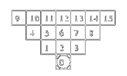
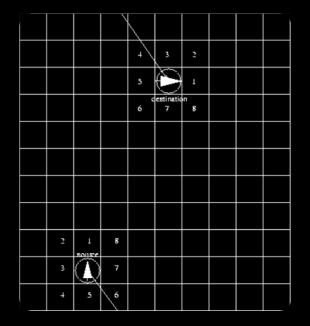

# ZAPPY: A Tribute to Zaphod Beeblebrox

Welcome to **ZAPPY**, a network game where teams compete on a dynamic tile map rich in resources. The goal is for your team to have at least 6 players reach the maximum elevation. Ready to get started? Let's dive in! 🚀

## 📋 Preliminaries

### Binary Names
- **Server:** `zappy_server`
- **GUI:** `zappy_gui`
- **AI:** `zappy_ai`

### Programming Languages
- **Server:** C
- **GUI:** C++
- **AI:** Free choice but we'll stick to C for this project

## 🌍 Environment

### 1. Geography
- The world, **Trantor**, is a flat plane with no elevations.
- The map loops: exiting on one side brings you back on the opposite side.

### 2. Resources
Trantor is rich in both minerals and food. Players will find:
- **Food**
- **Stones:** linemate, deraumere, sibur, mendiane, phiras, thystame

### 3. Activities
Players focus on:
- **Feeding themselves**
- **Collecting stones**

### 4. Individuals
- **Inhabitants:** Bodiless, pacifists, and occupy entire tiles.
- **Survival:** Requires food; 1 unit of food lasts 126 time units.

### 5. The Elevation Ritual
To elevate, players must gather specific stones and have the right number of same-level players on the same tile. Elevation details:

| Level   | Players | Linemate | Deraumere | Sibur | Mendiane | Phiras | Thystame |
|---------|---------|----------|-----------|-------|----------|--------|----------|
| 1 -> 2  | 1       | 1        | 0         | 0     | 0        | 0      | 0        |
| 2 -> 3  | 2       | 1        | 1         | 1     | 0        | 0      | 0        |
| 3 -> 4  | 2       | 2        | 0         | 1     | 0        | 2      | 0        |
| 4 -> 5  | 4       | 1        | 1         | 2     | 0        | 1      | 0        |
| 5 -> 6  | 4       | 1        | 2         | 1     | 3        | 0      | 0        |
| 6 -> 7  | 6       | 1        | 2         | 3     | 0        | 1      | 0        |
| 7 -> 8  | 6       | 2        | 2         | 2     | 2        | 2      | 1        |

### 6. Vision
Players' vision expands with each level.



Level one, the player only see itself and the first row directly in front of it. Level two, the player sees itself and the first two rows directly in front of it, and so on.

### 7. Sound Transmission
Players can broadcast messages. The sound travels in the direction indicated by the tile number.



## 🔧 Programs

### Binaries
1. **Server (C):** Manages the game world.
2. **Graphical Client (C++):** Visualizes the game world. (using `SFML`)
3. **AI Client (Free choice):** Controls a player autonomously.

### Usage
**Server:**
```
./zappy_server -p port -x width -y height -n team1 team2 ... -c clientsNb -f freq
```

**GUI:**
```
./zappy_gui -p port -h machine
```

**AI:**
```
./zappy_ai -p port -n team_name -h machine
```

### Commands
Players can perform various actions such as moving, turning, looking around, broadcasting, and more. Here are some key commands:

| Action       | Command          | Time (units)  | Response       |
|--------------|------------------|---------------|----------------|
| Move         | Forward          | 7/f           | ok             |
| Turn right   | Right            | 7/f           | ok             |
| Turn left    | Left             | 7/f           | ok             |
| Look         | Look             | 7/f           | [tile1, tile2, ...] |
| Inventory    | Inventory        | 1/f           | [linemate n, sibur n, ...] |
| Broadcast    | Broadcast text   | 7/f           | ok             |
| Fork         | Fork             | 42/f          | ok             |
| Eject        | Eject            | 7/f           | ok/ko          |
| Take object  | Take object      | 7/f           | ok/ko          |
| Set object   | Set object       | 7/f           | ok/ko          |
| Incantation  | Incantation      | 300/f         | Elevation underway/ko |

### Time Management
- Actions' execution time is calculated as `action / f`, where `f` is the reciprocal of the time unit.
- Default `f` value is 100.

## 🎮 Teams & Gameplay

- Teams start with `n` available slots (represented by eggs).
- Players have 10 life units initially (1260 time units or 1260/f seconds).
- **Reproduction:** Players can reproduce by laying eggs, increasing team slots.

## 📥 Protocol

### Client-Server Communication
- **Connection:** Clients connect via TCP sockets.
- **Initial Handshake:**
  ```
  <-- WELCOME \n
  --> TEAM-NAME \n
  <-- CLIENT-NUM \n
  <-- X Y \n
  ```

Clients send up to 10 commands without waiting for responses. Server executes commands in the received order.

### GUI protocol

> [!WARNING]
> The GUI protocol is a mandatory fixed protocol.  
> What is described below must be implemented as is. But you can add more commands if you want.

When a GUI connects to the server, it must send the following commands:

```
GRAPHIC
```

So the server knows it is a graphical client. The server will able to forward events to the GUI.  
And more importantly, the client will be able to send GUI commands to the server.

#### Symbols and Meanings
| Symbol | Meaning                         |
|--------|---------------------------------|
| X      | width or horizontal position    |
| Y      | height or vertical position     |
| q0     | resource 0 (food) quantity      |
| q1     | resource 1 (linemate) quantity  |
| q2     | resource 2 (deraumere) quantity |
| q3     | resource 3 (sibur) quantity     |
| q4     | resource 4 (mendiane) quantity  |
| q5     | resource 5 (phiras) quantity    |
| q6     | resource 6 (thystame) quantity  |
| n      | player number                   |
| O      | orientation: 1(N), 2(E), 3(S), 4(W) |
| L      | player or incantation level     |
| e      | egg number                      |
| T      | time unit                       |
| N      | name of the team                |
| R      | incantation result              |
| M      | message                         |
| i      | resource number                 |

#### Server Client Details
| Server Command                          | Client Command | Details                         |
|-----------------------------------------|----------------|---------------------------------|
| `msz X Y\n`                             | `msz\n`        | map size                        |
| `bct X Y q0 q1 q2 q3 q4 q5 q6\n`        | `bct X Y\n`    | content of a tile               |
| `bct X Y q0 q1 q2 q3 q4 q5 q6\n * nbr_tiles` | `mct\n`        | content of the map (all the tiles) |
| `tna N\n * nbr_teams`                   | `tna\n`        | name of all the teams           |
| `pnw #n X Y O L N\n`                    |                | connection of a new player      |
| `ppo #n X Y O\n`                        | `ppo #n\n`     | player’s position               |
| `plv #n L\n`                            | `plv #n\n`     | player’s level                  |
| `pin #n X Y q0 q1 q2 q3 q4 q5 q6\n`     | `pin #n\n`     | player’s inventory              |
| `pex #n\n`                              |                | expulsion                       |
| `pbc #n M\n`                            |                | broadcast                       |
| `pic X Y L #n #n ... \n`                |                | start of an incantation (by the first player) |
| `pie X Y R\n`                           |                | end of an incantation           |
| `pfk #n\n`                              |                | egg laying by the player        |
| `pdr #n i\n`                            |                | resource dropping               |
| `pgt #n i\n`                            |                | resource collecting             |
| `pdi #n\n`                              |                | death of a player               |
| `enw #e #n X Y\n`                       |                | an egg was laid by a player     |
| `ebo #e\n`                              |                | player connection for an egg    |
| `edi #e\n`                              |                | death of an egg                 |
| `sgt T\n`                               | `sgt\n`        | time unit request               |
| `sst T\n`                               | `sst T\n`      | time unit modification          |
| `seg N\n`                               |                | end of game                     |
| `smg M\n`                               |                | message from the server         |
| `suc\n`                                 |                | unknown command                 |
| `sbp\n`                                 |                | command parameter error         |


---

Dive into the world of Trantor, gather resources, elevate your players, and lead your team to victory! 🌟
